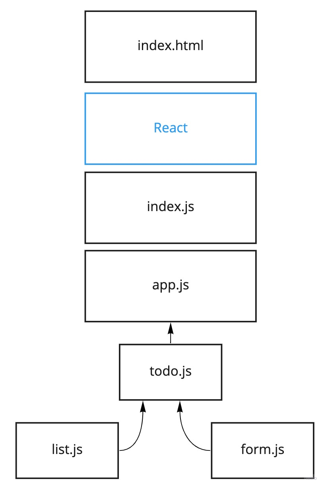

# LAB - Week 7

## Project: To Do

### Author: Brendan Smith

### Links and Resources

- [deployed site](https://distracted-galileo-14f56e.netlify.app/)
- [pull request](https://github.com/brendigler/todo/pull/1)

### Setup

#### `.env` requirements

- none

#### How to initialize/run your application

- clone to local repo
- `npm install`
- `npm start`

<!-- #### Tests -->

<!-- - Run tests with `npm test` -->

<!-- #### UML / Application Wiring Diagram -->

